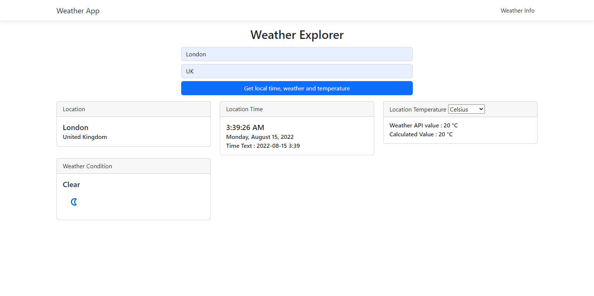
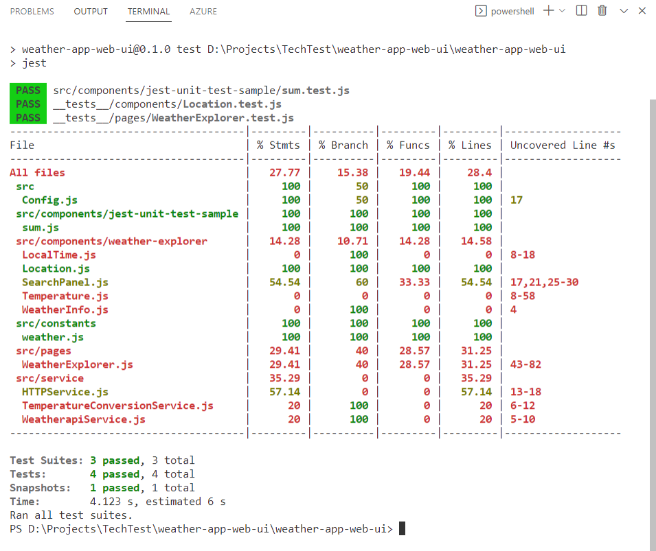
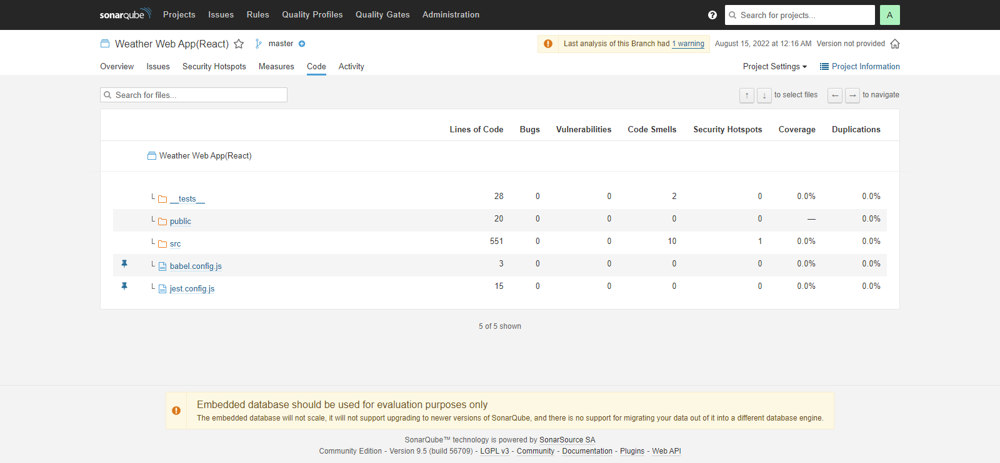
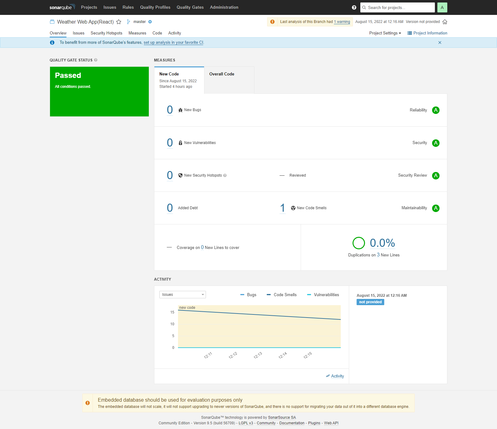

#Weather App Web UI

## Run the project

You need to have Node version 14.0.0+(https://nodejs.org/en/).
In the project directory, you can run:

Step 1, install the dependencies. 
### `npm i`

Step 2 , Run the app.

### `npm start`

Runs the app in the development mode.\
Open [http://localhost:3000](http://localhost:3000) to view it in your browser.

The page will reload when you make changes.\
You may also see any lint errors in the console.

 

## Run Jest unit tests
### `npm test`
Jest(https://jestjs.io/docs/tutorial-react) bases unit testing is integrated with the project.

 

## Result of the static code analysis  with Sonarqube

 

 

 # add Jenkin build file

